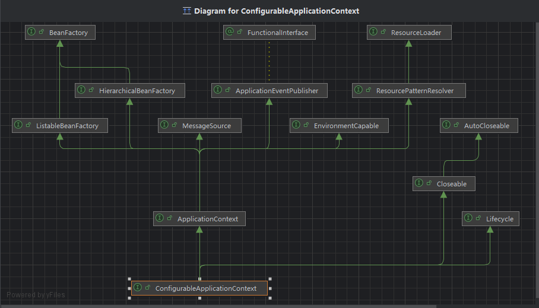

# BeanFactory与ApplicationContext

  ### BeanFactory和ApplicationContext之间的关系
  - BeanFactory是ApplicationContext的父接口
  - BeanFactory才是Spring的核心容器,像applicationContext.getBean()方法底层也是去其属性BeanFactory的集合中去找;
  - 从类图中也可以看出,applicationContext除了继承BeanFactory之外,还继承了多个其他
  接口,实现了更丰富的功能;

  ### BeanFactory的功能
  - 表面上只有getBean,实际上控制反转、基本的依赖注入、直至Bean的生命周期的各种功能,都由他的实现类(DefaultListableBeanFactory)提供
  - [代码演示DefaultListableBeanFactory中保存着储存单例bean的集合](/spring5/src/main/java/com/kul/a01/A01Application.java)

  ### ApplicationContext相较于BeanFactory的额外功能
  - 从类图可以看到,除了BeanFactory以外,ApplicationContext还继承了四个类,分别是
    - MessageSource: 表示具备了处理国际化资源的能力,提供了一种机制来管理和获取国际化消息
    - ResourcePatternResolver: 主要用于在类路径或文件系统中解析资源路径模式,它提供了一种机制来根据指定的模式加载资源文件,这对于在应用程序中
    查找和处理多个资源文件非常有用
    - ApplicationEventPublisher: 用于发布事件,它是Spring事件机制的一部分,允许应用程序通过发布事件来通知其他组件或处理程序发生了某些特定的
    操作和状态变化,目前是在A01Application中定义了事件的发布,在Component1中定义了事件的接收(监听)
    - EnvironmentCapable: 允许组件或类获取应用程序的环境配置信息,比如从application.properties或application.yaml中读取属性;

  ### spring事件机制的意义是啥
  - 解耦;
  - 假如我们现在有一个功能是旷视用户注册成功后要发送短信,海康用户注册成功后要发送邮件;当然这个逻辑我们可以写在一个方法里,但是这样耦合性太高了,而
  事件机制可以帮我们解耦,我们可以在Component1中定义注册用户的方法,并在成功注册后发布一个事件,这个事件类型的监听器我们写在Component2中,这样一
  监听到对应的事件类型,就可以继续发邮件;如果将来我们还要发彩信、或者纪念卡、礼品啥的,这种耦合性就降低了,我们只需要调整发布的事件类型,具体怎么处理
  我们可以添加对应的事件监听器