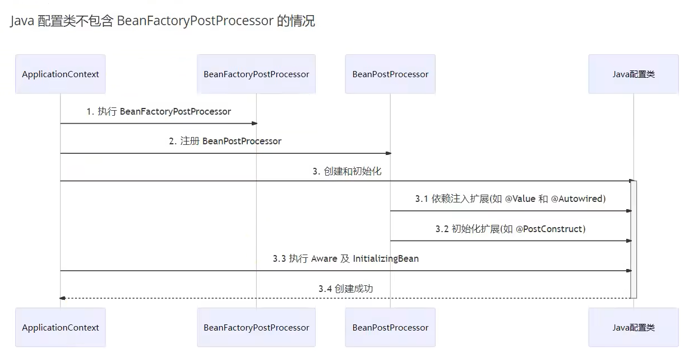
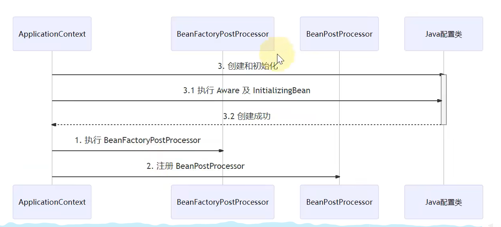

# Aware接口及InitializingBean接口

  ## Aware接口主要用于注入一些与容器相关信息,例如
  1. BeanNameAware注入Bean的名字
  2. 2BeanFactoryAware注入BeanFactory容器
  3. ApplicationContextAware注入ApplicationContext容器
  4. EmbeddedValueResolverAware 实现对 ${} 中数据的解析

  ## 但其实2,3,4三个功能我们都可以通过@Autowired注解实现,那为什么还需要用Aware接口呢
  - 简单地说
    - @Autowired的解析需要用到bean后处理器,属于扩展功能
    - 而Aware接口属于内置功能,不加任何扩展,Spring就能识别
  - 某些情况下,扩展功能会失效,而内置功能不会失效
  - 比如,如果我们使用GenericApplicationContext context = new GenericApplicationContext(),创建一个纯净的applicationContext时,即
  没有注册任何后置处理器时,我们会发现,Aware接口的回调依然生效,但是@Autowired注解则不再生效了;当然,如果希望该注解生效也很简单,只需要将解析@Autowired
  注解的后置处理器完成注册即可,即: context.registerBean(AutowiredAnnotationBeanPostProcessor.class);
    
  ## 一个@Autowired失效的实例即其原因
  - 案例: 、
  - 首先我们要了解spring的refresh()方法的大概流程
  - 正常情况: 
    - 会首先进行BeanFactory后置处理器和Bean后置处理器的注册,然后进行bean的创建和后续的后置处理器扩展功能生效,最终完成bean的创建;那么在这个流
    程中,可以看到在bean最终被创建出来之前,是进行了相关后置处理器的注册的,所以是可以识别相关@Autowired和@PostConstruct注解修饰的方法的,这是正
    常的情况
  - MyConfig1的情况: 
    - 但是在MyConfig1中有所不同,因为我们这里有一个@Bean修饰的配置了一个BeanFactory的后置处理器的方法;那么继续按照我们正常情况时的逻辑,我们要
    优先去进行BeanFactory后置处理器的注册,ok,那么我们当前MyConfig1这个配置类中的这个方法也会被识别,被调用,那么问题来了,这样一个方法被调用,前
    提条件是要有MyConfig1对象,所以,这里我们refresh的流程发生了变化,我们会首先创建一个配置类MyConfig1对象,但是注意了,这个时候还没有开始进行
    Bean后处理器和BeanFactory后处理器的注册,所以MyConfig1对象被创建时,是无法识别相关的@Autowired和@PostConstruct注解的,待后续后置处理器
    被注册,开始进行对象初始化时,发现MyConfig1已经被创建了,也就不在会创建了,所以最终我们的MyConfig1实际上是由一个纯净的applicationcontext创
    建的,所以它的其他注解失效了;
  - MyConfig2
    - 因为MyConfig2中使用的是aware内置功能,所以对MyConfig2没影响

  ## @Autowired失效的案例
  - Java配置类包含BeanFactory后置处理器时,会出现@Autowired注解失效的情况,其实不止是@Autowired,而是所有的需要依赖后置处理器的扩展功能都会失效;